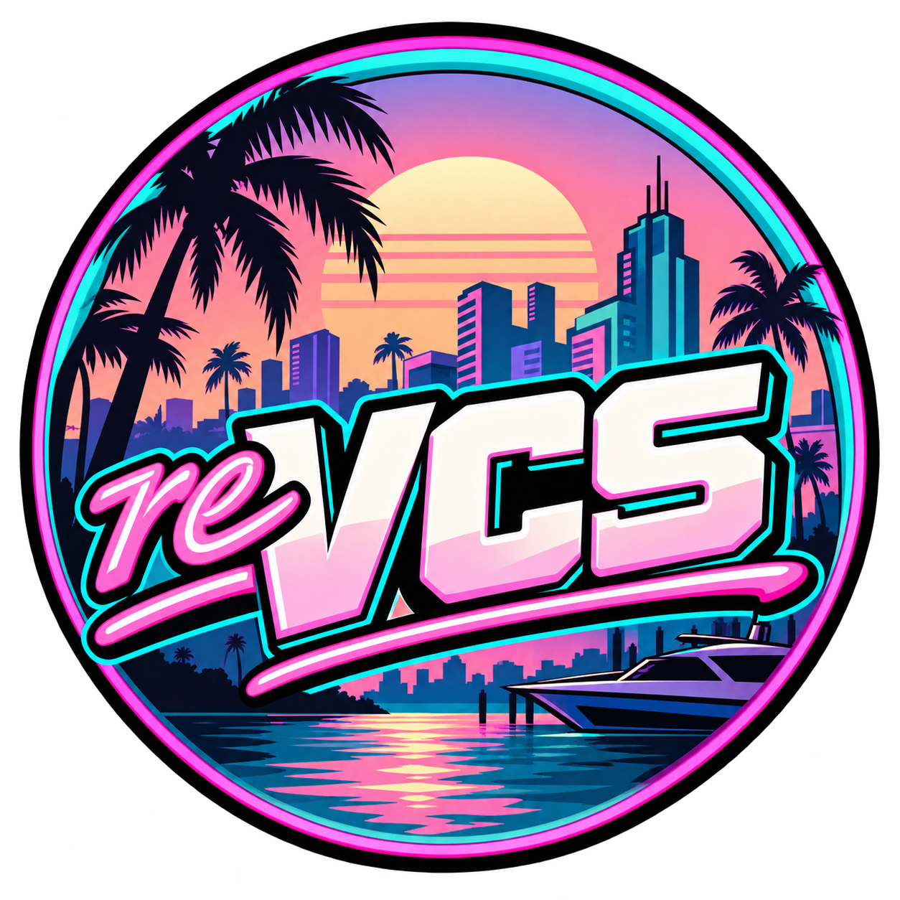

<p align="center">
  
</p>

<h1 align="center">PSPRecomp · Vice City Stories</h1>

<p align="center">Port experimental de Grand Theft Auto: Vice City Stories para Windows y Android ARM64, basado en recompilación estática de código PSP.</p>

<p align="center">
  
  
  
  
</p>

> **Estado actual:** el juego arranca y muestra gameplay en Windows y en un Galaxy S25 Ultra. En Android todavía hay caídas de rendimiento y defectos gráficos; la configuración segura usa el rasterizador software. Vulkan ya dibuja en GPU el framebuffer del mundo y su composición en un modo experimental, pero aún requiere corregir la imagen y comprobar el menú de pausa antes de usarlo como predeterminado.

## El proyecto

[PSPRecomp](https://github.com/jessicanataliagta/PSPRecomp) traduce código Allegrex a C++ nativo. Este repositorio añade el perfil VCS, los servicios de host para Windows y Android, y la aplicación ARM64. El código fuente del juego se recompila; los datos comerciales se cargan desde una copia local del usuario.

| Componente | Estado |
| --- | --- |
| Host Windows | Juego renderizado con DirectX 12 |
| App Android ARM64 | Arranque, imagen, audio y controles táctiles en desarrollo |
| Renderizador Android actual | Software, compilado con optimizaciones Release |
| Backend Vulkan Android | Dos pases para mundo y pantalla, con texturas RGBA, alpha test, niebla y profundidad D16; experimental |
| Rendimiento y paridad visual Android | Trabajo en curso; requiere más pruebas en el dispositivo |

## Android

Requisitos: Android SDK, NDK `28.2.13676358`, CMake `3.22.1`, Java compatible con Gradle 8.11.1 y un dispositivo ARM64 autorizado para ADB.

Desde PowerShell, en la raíz del repositorio:

```powershell
./build_android.ps1
./run_android.ps1
```

La app espera los datos extraídos de una copia propia en **Memoria interna/VCS** (`/storage/emulated/0/VCS`). El ELF descifrado debe estar en `VCS/PSP_GAME/SYSDIR/EBOOT_DECRYPTED.ELF`. La app requiere permiso de acceso a archivos para leer esa carpeta. El APK no incluye datos del juego.

Consulta [Vulkan en Android](docs/ANDROID_VULKAN.md) para conocer el estado técnico y las limitaciones del nuevo backend, y el [análisis de portabilidad](docs/ANDROID_PORT_ANALYSIS.md) para el mapa de componentes.

## Windows

Requisitos: Visual Studio 2022 con C++, Windows SDK, CMake y archivos de una copia propia del juego.

```powershell
./build_vcs.ps1
./run_vcs.ps1
```

La preparación local está en [setup_vcs.ps1](setup_vcs.ps1) y [prepare_game.ps1](profiles/vcs/tools/prepare_game.ps1).

## Datos y distribución

Este repositorio publica **solo código fuente**. No hay APK en Releases. No subas ISOs, EBOOTs, ELF descifrados, partidas ni recursos comerciales. Cada usuario debe aportar sus propios archivos del juego.

El framework PSPRecomp usa licencia MIT. Las licencias y avisos adicionales del perfil están en [THIRD_PARTY.md](profiles/vcs/THIRD_PARTY.md). Proyecto comunitario no oficial, sin afiliación con Rockstar Games ni Sony Interactive Entertainment.
